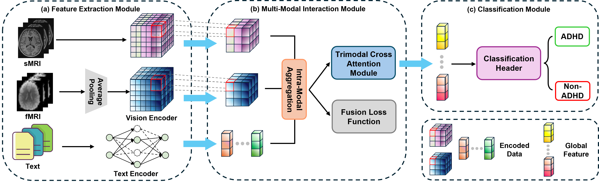

# MMAFN: Multi-Modal Attention Fusion Network for ADHD Classification

This repository contains the implementation of the **MMAFN: Multi-Modal Attention Fusion Network for ADHD Classification** project. The model integrates multimodal data, including fMRI, sMRI, and phenotypic information, to enhance classification accuracy for ADHD diagnosis.

## Table of Contents

1. [Project Structure](#project-structure)
2. [Algorithm Workflow](#algorithm-workflow)
3. [Environment Setup](#environment-setup)
4. [Training and Inference](#training-and-inference)
5. [Dataset Structure](#dataset-structure)
6. [Code Execution Example](#code-execution-example)
7. [Results](#results)
8. [Citation](#citation)

---

## 1. Project Structure

The directory structure of the project is as follows:

```
MMAFN/
├── data/                      # Dataset processing module
│   └── dataset.py             # Script for dataset handling and preprocessing
├── Net/                       # Network architecture and model components
│   ├── api.py                 # API for model training and evaluation
│   ├── basicArchs.py          # Basic architectures for fMRI, sMRI, and text encoders
│   ├── cp_networks.py         # Cross-modal network architectures
│   ├── fusions.py             # Fusion strategies for multimodal data
│   ├── loss_functions.py      # Custom loss functions
│   ├── mamba_modules.py       # Mamba module for long-range dependency modeling
│   └── networks.py            # MMAFN model definition
├── utils/                     # Utility scripts for data processing and evaluation
│   ├── model_object.py        # Model object handler
│   └── observer.py            # Monitoring and logging
├── main.py                    # Core script to execute the MMAFN model pipeline
```

---

## 2. Algorithm Workflow

The MMAFN model is designed with the following key components:

1. **Feature Extraction**:
   - **fMRI and sMRI**: Use a 3D ResNet-50 model to extract features from functional and structural MRI data.
   - **Phenotypic Data**: Phenotypic information (e.g., age, gender, IQ, handedness) is encoded using BioBERT.

2. **Multi-Modal Attention Fusion Module**:
   - The fusion module uses cross-attention mechanisms, including the **Mamba module**, to model long-range dependencies and improve multimodal feature fusion.

3. **Classification**:
   - The fused features are processed through a **DenseNet-based classifier** to predict ADHD diagnosis.

A diagram explaining the architecture is shown below:



---

## 3. Environment Setup

This project requires Python 3.8 and the following dependencies:

- **PyTorch**: 2.0.0
- **CUDA**: 11.8 (for GPU support)

To set up the environment, you can use:

```bash
pip install -r requirements.txt
```

Alternatively, using `conda`:

```bash
conda create -n mmafn python=3.8
conda activate mmafn
conda install pytorch==2.0.0 cudatoolkit=11.8 -c pytorch
pip install -r requirements.txt
```

### Hardware Requirements

For optimal performance, we recommend using an NVIDIA GPU (such as A100) with at least 16GB VRAM.

---

## 4. Training and Inference

### Training

To train the MMAFN model, run the following command:

```bash
python main.py --mode train --data_path ./data --epochs 300 --batch_size 2
```

- **Parameters**:
  - `--mode`: Set to `train` for training.
  - `--data_path`: Path to the dataset.
  - `--epochs`: Number of training epochs (default: 300).
  - `--batch_size`: Batch size for training (default: 2).

### Inference

To perform inference with a trained model, use:

```bash
python main.py --mode test --model_path ./models/mmafn.pth --data_path ./data
```

- **Parameters**:
  - `--mode`: Set to `test` for inference.
  - `--model_path`: Path to the pre-trained model file.
  - `--data_path`: Path to the dataset for inference.

---

## 5. Dataset Structure

The dataset should be organized as follows:

```
data/
├── fMRI/                # fMRI data
├── sMRI/                # sMRI data
└── text/                # Phenotypic data (e.g., age, gender, IQ, handedness)
```

Ensure that the dataset contains the **ADHD-200** dataset, with appropriate preprocessing for fMRI and sMRI data, and phenotypic information for text encoding.

### Data Preprocessing

- **MRI Data**: Standardize the fMRI and sMRI images.
- **Phenotypic Data**: Encode the phenotypic data using BioBERT to extract relevant features.

---

## 6. Code Execution Example

Here are some examples of how to execute the code:

### Training Example

```bash
python main.py --mode train --data_path ./data --epochs 300 --batch_size 2
```

### Inference Example

```bash
python main.py --mode test --model_path ./models/mmafn.pth --data_path ./data
```

---

## 7. Results

### Performance on ADHD Classification

| Method              | Modality            | ACC (%) | Precision (%) | Recall (%) | F1 Score | AUC   |
|---------------------|---------------------|---------|---------------|------------|----------|-------|
| 3D-CNN (fMRI)       | fMRI                | 71.85   | 75.4          | 63.57      | 0.6908   | 0.7215|
| 3D-CNN (sMRI)       | sMRI                | 73.1    | 77.02         | 60.58      | 0.6803   | 0.732 |
| TextCNN (Text)      | Text                | 65.31   | 67.9          | 55.2       | 0.6089   | 0.6845|
| Trimodal ADF-FAD    | fMRI+sMRI+Text      | 79.45   | 82.13         | 68.27      | 0.7465   | 0.7874|
| Trimodal GCN        | fMRI+sMRI+Text      | 81.27   | 84.01         | 70.52      | 0.7681   | 0.8015|
| Trimodal MMGL       | fMRI+sMRI+Text      | 78.92   | 81.37         | 69.58      | 0.7483   | 0.7902|
| **MMAFN (Our)**      | fMRI+sMRI+Text      | **83.51**   | **88.39**         | **77.46**      | **0.8255**   | **0.8237** |

### Ablation Study

| Configuration       | ACC (%) | Precision (%) | Recall (%) | F1 Score | AUC   |
|---------------------|---------|---------------|------------|----------|-------|
| fMRI-only           | 78.24   | 83.47         | 65.23      | 0.7322   | 0.7648|
| sMRI-only           | 74.15   | 82.13         | 58.41      | 0.6847   | 0.7415|
| Text-only           | 69.88   | 78.26         | 47.89      | 0.5952   | 0.6832|
| fMRI+sMRI           | 80.45   | 86.72         | 69.38      | 0.7694   | 0.7924|
| fMRI+Text           | 81.32   | 84.61         | 71.85      | 0.7776   | 0.8072|
| sMRI+Text           | 80.22   | 82.88         | 74.32      | 0.7839   | 0.7985|
| **fMRI+sMRI+Text**  | **83.51**   | **88.39**         | **77.46**      | **0.8255**   | **0.8237** |


---

### Citation
```
@InProceedings{jia2025mmafn,
    author    = {Jia, J. and Liang, R. and Zhang, C. and et al.},
    title     = {MMAFN: Multi-Modal Attention Fusion Network for ADHD Classification},
    booktitle = {IEEE International Symposium on Biomedical Imaging -- ISBI 2025},
    month     = {April},
    year      = {2025},
    url       = {}
}
```


---

For additional details, please refer to our [paper](path/to/your/paper).

